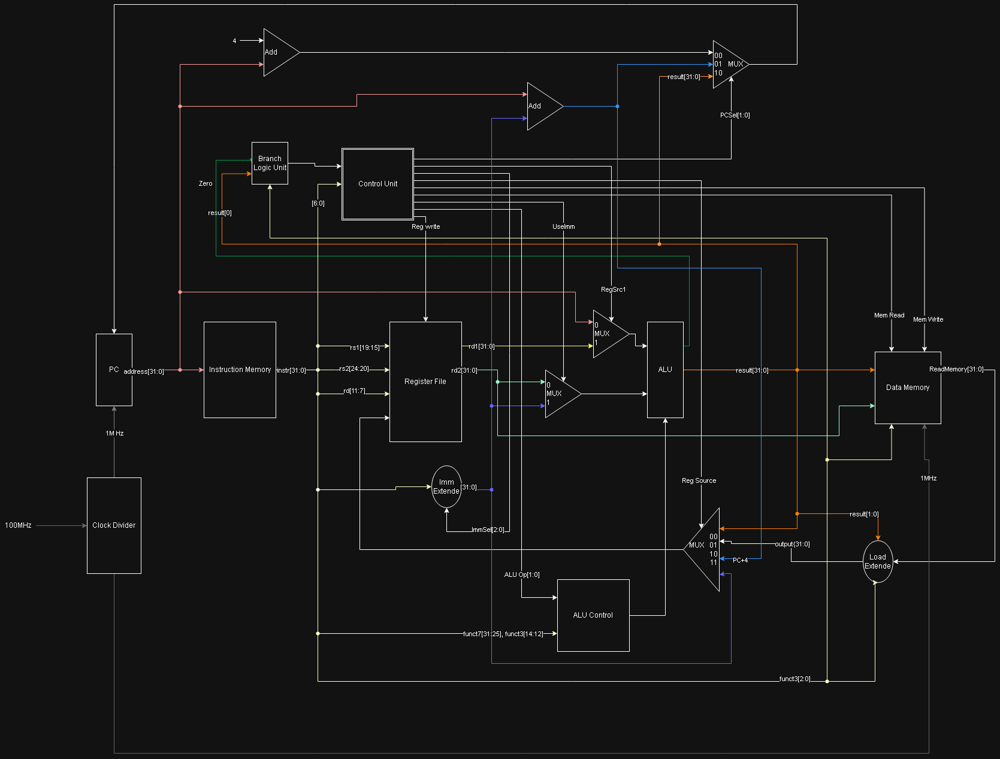

# ArmmyRV32I

ArmmyRV32I is a modular, single-cycle 32-bit RISC-V processor core written in Verilog. It implements the main integer arithmetic, load/store, branch, and jump instructions from the RV32I base ISA and is intended for learning, simulation, and FPGA experimentation.

## Overview

The core uses a Harvard-style organization with separate instruction and data memories. [`src/RV32I_Core.v`](src/RV32I_Core.v) connects the program counter, decoder and control path, register file, ALU, immediate generator, branch logic, memories, and write-back multiplexers.

The top-level core accepts a clock and active-high reset:

```verilog
module RV32I_Core(
    input clk_in,
    input reset
);
```

`ClockDivider` is configured for a 100 MHz input clock and supplies a 1 MHz clock to the processor state elements.

## Datapath



## Features

- Single-cycle, 32-bit RISC-V datapath
- 32 general-purpose registers with `x0` hardwired to zero
- Separate 4 KiB instruction and data memories
- Asynchronous register and memory reads with synchronous register and data-memory writes
- Byte, half-word, and word loads and stores
- Signed and unsigned comparisons and load extension
- PC-relative branches, `jal`, `jalr`, `lui`, and `auipc`
- Modular RTL with standalone testbenches for the ALU, instruction memory, and complete core
- VCD waveform generation from each included testbench

## Supported Instructions

| Format | Instructions |
|---|---|
| Register-register | `add`, `sub`, `sll`, `slt`, `sltu`, `xor`, `srl`, `sra`, `or`, `and` |
| Register-immediate | `addi`, `slli`, `slti`, `sltiu`, `xori`, `srli`, `srai`, `ori`, `andi` |
| Loads | `lb`, `lh`, `lw`, `lbu`, `lhu` |
| Stores | `sb`, `sh`, `sw` |
| Branches | `beq`, `bne`, `blt`, `bge`, `bltu`, `bgeu` |
| Jumps | `jal`, `jalr` |
| Upper immediates | `lui`, `auipc` |

System instructions, fence instructions, exceptions, interrupts, and CSRs are not implemented.

## Getting Started

### Prerequisites

Use a Verilog simulator or FPGA tool that supports `$readmemh` and VCD system tasks. The source headers and project layout are compatible with a typical AMD Vivado RTL project, but no tool-specific project files or command scripts are included.

### Configure Program Memory

Machine code is loaded into instruction memory during initialization. A small example program is provided in [`src/instruction.mem`](src/instruction.mem).

Before simulation or synthesis, update the `$readmemh` filename in [`src/InstructionMemory.v`](src/InstructionMemory.v) to a path that resolves to that file in your environment. The repository currently contains the original author's absolute Windows path:

```verilog
$readmemh("C:/path/to/ArmmyRV32I/src/instruction.mem", memory);
```

The memory file contains one 32-bit hexadecimal instruction per line. The bundled program performs the following operations and then loops:

```text
addi x1, x0, 5
addi x2, x0, 10
add  x3, x1, x2
sw   x3, 0(x0)
jal  x0, 0
```

### Simulate the Core

1. Add every `.v` file under `src/` as design sources.
2. Add `src/instruction.mem` as a memory initialization file and configure the path described above.
3. Add the desired file from `testbench/` as a simulation source.
4. Select its testbench module as the simulation top.
5. Run the simulation and inspect the generated VCD waveform.

For the complete processor, use `tb_RV32I_Core` as the simulation top. Its input clock has a 10 ns period, matching the divider's expected 100 MHz input.

## Testbenches

| Top module | File | Coverage |
|---|---|---|
| `tb_ALU` | [`testbench/tb_ALU.v`](testbench/tb_ALU.v) | Steps through the ALU control values and writes `waveform.vcd` |
| `tb_InstructionMemory` | [`testbench/tb_InstructionMemory.v`](testbench/tb_InstructionMemory.v) | Reads the first ten word-aligned instruction addresses and writes `InstructionMemory.vcd` |
| `tb_RV32I_Core` | [`testbench/tb_RV32I_Core.v`](testbench/tb_RV32I_Core.v) | Resets and runs the integrated core, writing `waveform.vcd` |

These are waveform-oriented stimulus testbenches; they do not contain self-checking assertions.

## Project Structure

```text
.
|-- pic/
|   `-- RV32IDataPathByArmmy.drawio.png
|-- src/
|   |-- RV32I_Core.v          # Top-level processor
|   |-- ControlUnit.v         # Opcode decoder and control signals
|   |-- ALU.v                 # Arithmetic, logic, shifts, and comparisons
|   |-- ALUControl.v          # funct3/funct7 ALU decoder
|   |-- RegisterFiles.v       # 32 x 32-bit register file
|   |-- InstructionMemory.v   # 4 KiB program memory
|   |-- DataMemory.v          # 4 KiB byte-enabled data memory
|   |-- ImmExtender.v         # I/S/B/U/J immediate generation
|   |-- LoadExtender.v        # Byte and half-word load extension
|   |-- BranchLogicUnit.v     # Branch condition evaluation
|   |-- ClockDivider.v        # 100 MHz to 1 MHz divider
|   |-- MUX*.v                # ALU, PC, and write-back selection
|   |-- PC*.v                 # Program counter and PC adders
|   `-- instruction.mem       # Example machine-code program
|-- testbench/                # Simulation testbenches
|-- LICENSE
`-- README.md
```

## Implementation Notes

- Instruction and data memories each contain 1,024 32-bit words. Address bits `[11:2]` select a word.
- The design does not detect or trap misaligned memory accesses.
- `jalr` selects the raw ALU result as the next PC; the implementation does not explicitly clear address bit 0 as required by the RISC-V specification.
- The top-level module exposes only `clk_in` and `reset`; there is no external memory bus, debug port, or memory-mapped I/O interface.

## License

See [`LICENSE`](LICENSE) for the repository's non-commercial use and attribution terms.
